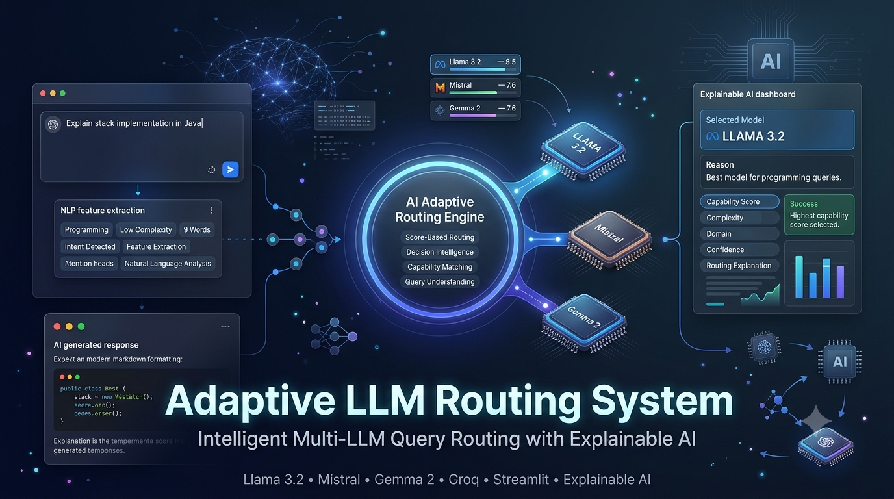

<p align="center">
  
</p>

<h1 align="center">🧠 Adaptive LLM Routing System</h1>

<p align="center">
Intelligent Multi-LLM Query Routing with Explainable AI
</p>

<p align="center">
  
  
  
  
  
  
  
</p>

---

# 🚀 Live Demo

🌐 **https://multillm-router.streamlit.app**

Experience an intelligent routing system that analyzes each query and dynamically selects the most suitable Large Language Model while providing a transparent explanation of its decision.

---

# 📖 Project Overview

Adaptive LLM Routing System is an intelligent AI framework that automatically routes user queries to the most appropriate Large Language Model (LLM) based on query characteristics instead of relying on a single model for every request.

The system analyzes the user's query, extracts important features such as domain, complexity, and query type, evaluates multiple language models using a score-based routing algorithm, selects the best-performing model, and explains why that model was chosen.

Unlike conventional AI assistants, the routing process is fully explainable, allowing users to understand the reasoning behind every model selection.

---

# ❓ Problem Statement

Modern Large Language Models excel in different domains.

Some models perform exceptionally well for programming tasks, while others are stronger at reasoning, creative writing, or general question answering.

Using a single LLM for every query often leads to:

- Lower response quality
- Unnecessary computational cost
- Poor model utilization
- Lack of transparency in model selection

This project addresses these challenges by introducing an adaptive score-based routing framework capable of selecting the most suitable model for each incoming query.

---

# 💡 Solution

The proposed system intelligently analyzes every query before generating a response.

Instead of randomly selecting an LLM, the framework:

- Extracts important query features
- Computes capability scores for multiple models
- Selects the highest-scoring model
- Explains why the model was selected
- Generates the final response

This creates an efficient, transparent, and scalable multi-LLM architecture.

---

# ✨ Key Features

- 🤖 Intelligent multi-LLM routing
- 📊 Score-based model selection
- 🧠 Query feature extraction
- 📈 Capability profiling of different LLMs
- 🎯 Automatic model recommendation
- 💬 Explainable routing decisions
- 🌐 Interactive Streamlit dashboard
- ⚡ Real-time response generation
- ☁️ Cloud deployment
- 🔍 Transparent model scoring

---

# 🏗️ System Workflow

```text
                    User Query
                         │
                         ▼
              Query Feature Extraction
                         │
        ┌─────────────────────────────────┐
        │                                 │
        │ Query Type                      │
        │ Domain Detection                │
        │ Complexity Analysis             │
        │ Word Count                      │
        └─────────────────────────────────┘
                         │
                         ▼
             Score-Based Routing Engine
                         │
        ┌──────────┬──────────┬──────────┐
        │          │          │          │
        ▼          ▼          ▼
    Llama 3.2   Mistral    Gemma 2
        │          │          │
        └──────────┴──────────┘
                Capability Scores
                         │
                         ▼
           Highest Scoring Model Selected
                         │
                         ▼
         Explainable Routing Decision
                         │
                         ▼
              AI Generated Response
```

---

# 🧠 Explainable AI

One of the key features of this project is transparency.

Instead of simply returning a response, the system explains:

- Selected language model
- Query category
- Complexity level
- Detected domain
- Capability scores
- Score comparison
- Final routing decision
- Reason for model selection

This enables users to understand how routing decisions are made, improving trust and interpretability.

---

# 🛠️ Technologies Used

| Category | Technologies |
|-----------|--------------|
| Programming Language | Python 3.13 |
| AI / LLM Models | Llama 3.2, Mistral, Gemma 2 |
| Cloud API | Groq API |
| Framework | Streamlit |
| Local LLM Runtime | Ollama |
| Visualization | Matplotlib |
| Environment Management | Python-dotenv |
| Version Control | Git, GitHub |
| Deployment | Streamlit Community Cloud |
| Development Environment | Cursor |
| Concepts | Score-Based Routing, Query Feature Extraction, Explainable AI, Multi-LLM Integration, Performance Evaluation |
| Hardware | Apple MacBook Air M2 |

---

# 📸 Application Screenshots

## 🏠 Home Page


The landing page allows users to enter natural language queries for intelligent routing.

---

## 📊 Query Analysis & Routing Dashboard


Displays:

- Query Type
- Complexity
- Domain
- Word Count
- Capability scores for all available LLMs
- Automatically selected model

---

## 💡 Explainable Routing Decision


Provides complete transparency by explaining why the selected model achieved the highest routing score.

---

## 💬 Generated Response


Shows the final response generated by the selected Large Language Model.

---

# 📄 Research Paper

The complete research paper describing the proposed framework is available here:

📄 **paper/Adaptive_Score_Based_LLM_Routing_Framework.pdf**

The paper discusses:

- Motivation
- Literature Review
- Proposed Architecture
- Score-Based Routing Algorithm
- Experimental Evaluation
- Results
- Future Scope

---

# 📂 Repository Structure

```text
Adaptive-LLM-Routing-System/
│
├── images/
│   ├── banner.png
│   ├── home.png
│   ├── routing-dashboard.png
│   ├── explainable-routing.png
│   └── generated-response.png
│
├── paper/
│   └── Adaptive_Score_Based_LLM_Routing_Framework.pdf
│
└── README.md
```

---

# ⚠️ Source Code Availability

The original implementation files for this project were lost after deployment.

This repository is maintained to preserve the research work, application demonstration, project documentation, and system architecture.

The live deployment and research paper fully document the proposed Adaptive LLM Routing framework.

---

# 🚀 Future Enhancements

- Support for additional LLMs
- Dynamic routing using reinforcement learning
- Cost-aware model selection
- User preference personalization
- Latency-aware routing
- Multi-agent collaboration
- RAG integration
- Performance analytics dashboard

---

# 👩‍💻 Authors

**Kavya Spoorthi**

B.Tech – Computer Science & Engineering (Artificial Intelligence & Machine Learning)

B V Raju Institute of Technology

---

# ⭐ Support

If you found this project interesting, consider giving this repository a ⭐.
